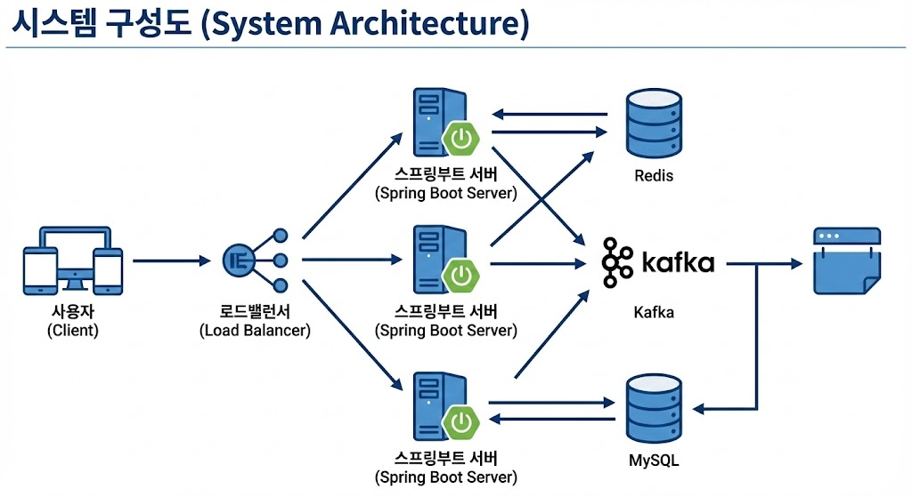

# 🎟️ High-Traffic Coupon System (선착순 쿠폰 발급 시스템)

> **"수만 명이 동시에 접속할 때 서버는 버틸 수 있는가?"**
> 대용량 트래픽 상황에서의 동시성 제어와 시스템 안정성을 확보하기 위한 프로젝트입니다.

 

## 1. 🚩 프로젝트 개요
단순한 CRUD 기능을 넘어, 실제 서비스에서 발생할 수 있는 **대규모 트래픽** 상황을 가정하고 이를 기술적으로 해결하는 데 초점을 맞췄습니다.

* **프로젝트 목표**: 초당 1만 건(10,000 TPS) 이상의 요청 상황에서도 데이터 부정합(Over-issuance) 없이 정확히 1,000개의 쿠폰을 발급.
* **주요 과제**: Race Condition 해결, DB 부하 분산, 비동기 처리를 통한 시스템 안정성 확보.

 

## 2. 🏛️ 시스템 아키텍처 (System Architecture)

* **Load Balancer**: 트래픽 분산
* **Redis**: 분산 락(Distributed Lock)을 통한 동시성 제어 및 고속 데이터 처리
* **Kafka**: 쿠폰 생성 요청을 비동기 메시지로 큐잉하여 MySQL 부하 감소 (Backpressure 조절)
* **MySQL**: 최종 데이터 영속성 보장

 

## 3. 🛠️ 기술 스택 및 선정 이유 (Tech Stack)

| 기술 (Technology) | 선정 이유 (Why Used?) |
| --- | --- |
| **Java 17 & Spring Boot 3.5.9** | 최신 Java 환경에서의 안정적이고 생산성 높은 백엔드 구축 |
| **MySQL 8.0** | ACID 트랜잭션을 보장하여 쿠폰 발급의 최종 데이터 정합성 유지 |
| **Redis** | In-memory 기반의 빠른 속도로 재고 확인 및 **분산 락(Distributed Lock)** 구현 |
| **Apache Kafka** | 요청 폭주 시 DB 병목 현상을 막기 위한 메시지 브로커 (Producer-Consumer 패턴) |
| **JMeter** | 초당 1만 건 이상의 동시 접속 트래픽을 시뮬레이션하고 검증하기 위한 부하 테스트 도구 |

 

## 4. 🔥 트러블 슈팅 및 성능 개선 (Key Achievements)
...

 

## 5. 📊 부하 테스트 결과 (Performance)

 
